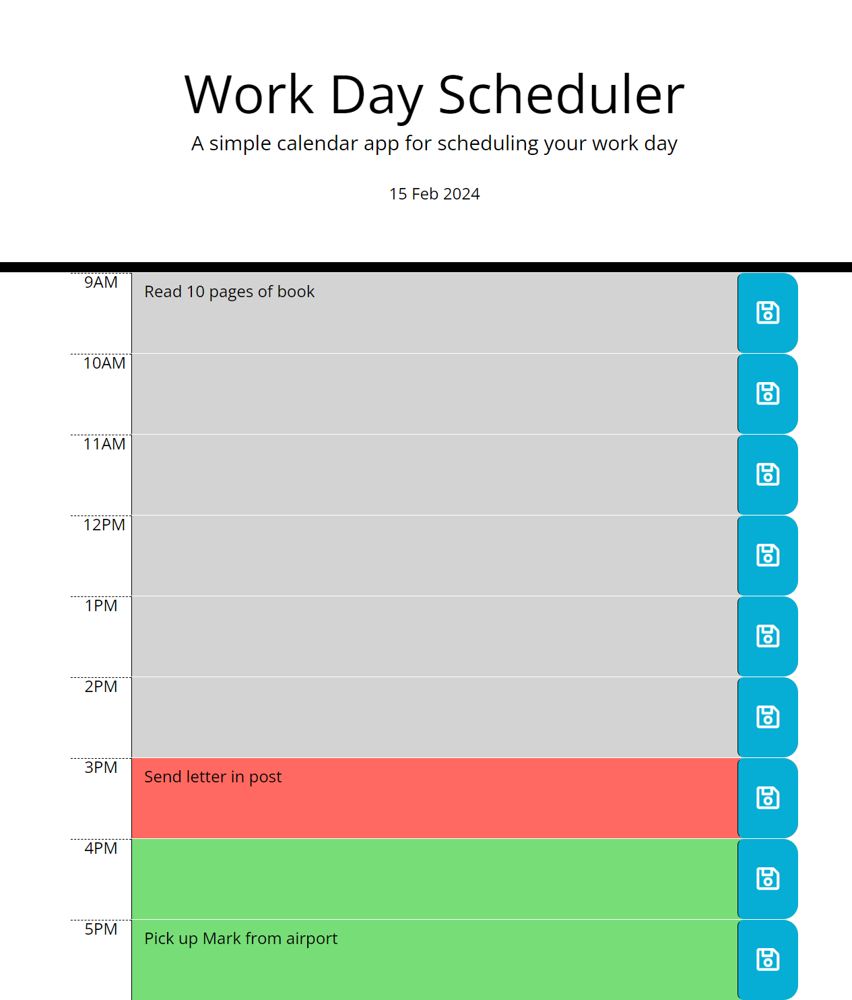

# Third-Party APIs: Work Day Scheduler
An application to allow users to save events for each work hour of the day, featuring HTML, CSS, day.js library and JQuerey.

## Descritption
This project is a daily planner that allows employees to organise their work day. It utilises the day.js library to handle date and time, as well as local storage. This project was built to become familiar with the day.js library, JQuerey and local storage in javascript. During the course of this project the functionality of the day.js library  and local storage was understood to generate this work day planner. 

## User Story

* AS AN employee with a busy schedule I WANT to add important events to a daily planner SO THAT I can manage my time effectively

## This project does the following:
* Displays the current day at the top of the calender when a user opens the planner.
 
* Presents timeblocks for standard business hours when the user scrolls down.
 
* Each timeblock is colour coded based on past, present, and future when the timeblock is viewed.
 
* Allows the user to enter an event when they click a timeblock

* Saves the event in local storage when the save button is clicked in that timeblock.

* Persists events between refreshes of a page

## Website view of application: 

### Link to deployed application
Access the live application [here](https://jessi994.github.io/work-day-scheduler/)

### Credits

N/A

### License

N/A
